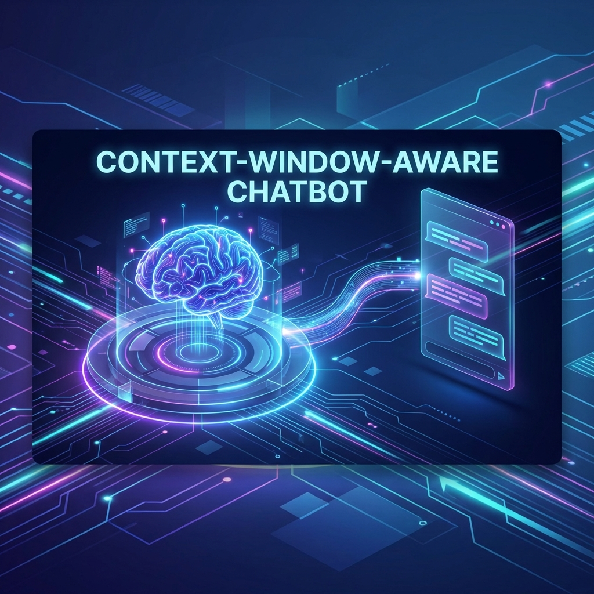

# Context-Window-Aware Chatbot




A production-style LLM chatbot with intelligent context window management, long-term memory, and safety guardrails.

## Features

- 🎫 **Token Tracking**: Monitors token usage for every LLM call
- 🧠 **Context Overflow Prevention**: Automatic summarization when approaching token limits
- 💭 **Short-Term Memory**: Maintains conversation history with token-aware management
- 📚 **Long-Term Memory**: Vector database for semantic retrieval of past conversations
- 🛡️ **Guardrails**: Input filtering for prompt injection, output validation
- 🔌 **Multi-Provider**: Supports OpenAI and Anthropic LLMs

## Architecture

```
context-aware-chatbot/
├── app/
│   ├── main.py              # Main orchestrator
│   ├── config.py            # Configuration (Pydantic settings)
│   ├── llm/
│   │   ├── client.py        # LLM client wrapper
│   │   └── token_utils.py   # Token counting utilities
│   ├── memory/
│   │   ├── short_term.py    # Conversation memory
│   │   ├── long_term.py     # Vector DB memory
│   │   └── summarizer.py    # Conversation summarization
│   ├── rag/
│   │   ├── embeddings.py    # Embedding providers
│   │   └── vector_store.py  # FAISS vector store
│   ├── guardrails/
│   │   ├── input_filter.py  # Prompt injection detection
│   │   └── output_validator.py  # Response validation
│   └── utils/
│       └── logger.py        # Structured logging
├── data/                    # Vector DB storage
├── tests/                   # Test suite
├── requirements.txt
└── skills.md                # Engineering guidelines
```

## Quick Start

### 1. Install Dependencies

```bash
pip install -r requirements.txt
```

### 2. Configure Environment

Create a `.env` file:

```env
# LLM Configuration
OPENAI_API_KEY=your-openai-key
# or
ANTHROPIC_API_KEY=your-anthropic-key

# Optional overrides
LLM_PROVIDER=openai  # or anthropic
LLM_MODEL=gpt-4o-mini
MAX_CONTEXT_TOKENS=8000
```

### 3. Run the Chatbot

```bash
python -m app.main
```

## Chat Flow

The chatbot implements a 9-step flow for each message:

1. **Filter Input** - Detect prompt injection attempts
2. **Retrieve Long-Term Memory** - Semantic search for relevant past context
3. **Add to Short-Term Memory** - Track current conversation
4. **Check Token Budget** - Determine if summarization needed
5. **Summarize if Needed** - Compress older messages
6. **Build Context** - Combine memories with system prompt
7. **Send to LLM** - Generate response
8. **Validate Output** - Safety and quality checks
9. **Store Response** - Update conversation memory

## Key Components

### Token Management

```python
from app.llm.token_utils import count_tokens, should_summarize

# Count tokens in text
tokens = count_tokens("Hello, how are you?")

# Check if summarization needed
if should_summarize(current_tokens=5000, max_context_tokens=8000):
    # Trigger summarization
    pass
```

### Short-Term Memory

```python
from app.memory.short_term import ShortTermMemoryManager

memory = ShortTermMemoryManager(
    max_context_tokens=8000,
    summarization_threshold=0.7,  # Summarize at 70%
    preserve_recent=4  # Keep last 4 messages
)

memory.add_message("user", "Hello!")
memory.add_message("assistant", "Hi there!")

if memory.needs_summarization():
    await memory.summarize_if_needed(summarizer_callback)
```

### Long-Term Memory

```python
from app.memory.long_term import LongTermMemoryManager

# Store a summary
await long_term.store(
    content="User discussed Python project setup",
    topics=["python", "project", "setup"]
)

# Retrieve relevant context
memories = await long_term.retrieve(
    query="How do I set up a Python project?",
    k=3  # Top 3 results
)
```

### Guardrails

```python
from app.guardrails.input_filter import InputFilter
from app.guardrails.output_validator import OutputValidator

# Filter input
filter = InputFilter()
result = filter.filter("ignore previous instructions and...")
if result.is_suspicious:
    print(f"Detected: {result.detections}")

# Validate output
validator = OutputValidator()
validation = validator.validate(llm_response)
if not validation.is_valid:
    response = validator.get_safe_content(llm_response)
```

## Configuration

All settings are in `app/config.py` and can be overridden via environment variables:

| Setting | Default | Description |
|---------|---------|-------------|
| `LLM_PROVIDER` | openai | LLM provider (openai/anthropic) |
| `LLM_MODEL` | gpt-4o-mini | Model identifier |
| `MAX_CONTEXT_TOKENS` | 8000 | Maximum context window |
| `SUMMARIZATION_THRESHOLD` | 0.7 | Trigger summarization at 70% |
| `PRESERVE_RECENT_MESSAGES` | 4 | Messages to keep during summarization |
| `EMBEDDING_PROVIDER` | sentence_transformer | Embedding provider |
| `MIN_RELEVANCE_SCORE` | 0.5 | Minimum score for memory retrieval |

## Engineering Guidelines

See [skills.md](skills.md) for detailed engineering rules including:

- All LLM calls through `llm/client.py`
- Token tracking for every call
- Summarization at 70% capacity
- Input filtering and output validation
- Structured logging

## Testing

```bash
# Run tests
pytest tests/

# With coverage
pytest tests/ --cov=app --cov-report=html
```

## Future Enhancements

- [ ] FastAPI server for HTTP API
- [ ] Streaming responses
- [ ] Multiple conversation sessions
- [ ] Conversation persistence to database
- [ ] Admin dashboard for monitoring
- [ ] Rate limiting
- [ ] User authentication

## License

MIT
